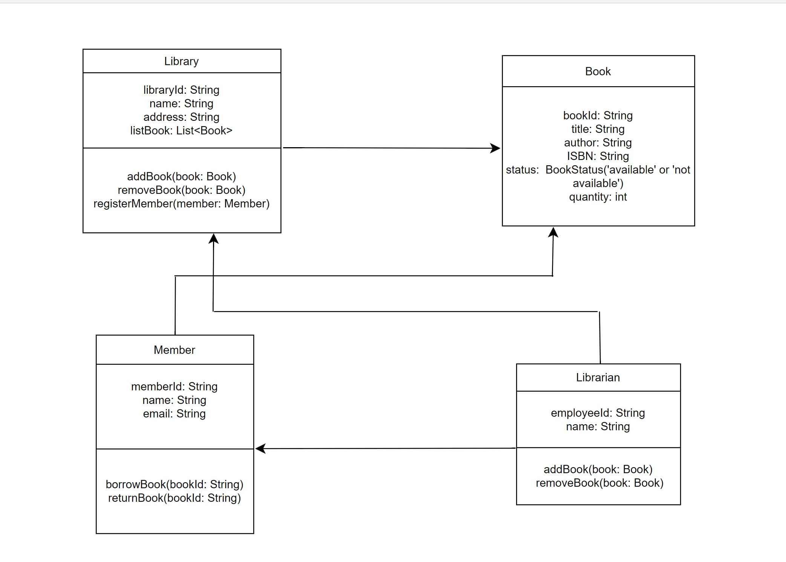
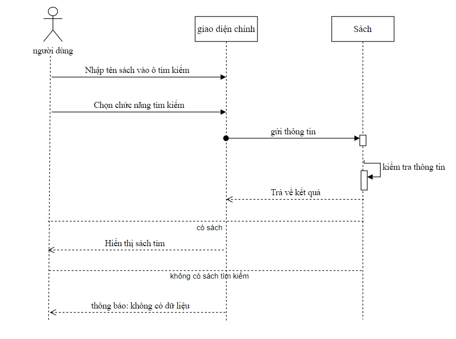
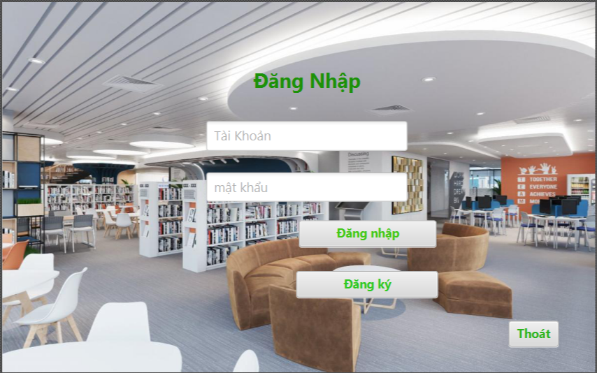

# GROUP_04-OOP-N03

## Hệ Thống Quản Lý Thư Viện

### Giới Thiệu Dự Án
Dự án này là một hệ thống quản lý thư viện, giúp tối ưu hóa và cải thiện hiệu quả hoạt động của các thư viện. Hệ thống cho phép người quản lý thư viện dễ dàng thêm, chỉnh sửa thông tin sách và theo dõi người mượn.
Người dùng cũng có thể xem thông tin sách có sẵn và tình trạng mượn trả của mình.
---

### Mục tiêu cần đạt được
**1. Giao diện**
   - Ứng dụng sử dụng giao diện đồ họa của JavaFX.  

**2. Chức năng**
   - Chức năng đăng nhập.  
   - Chức năng đăng ký.  
   - Thêm, sửa, xoá thông tin sách.  
   - Quản lý mượn và trả sách, gia hạn.  
   - Kiểm tra tình trạng sách (còn hay đã mượn).  

**3. Dữ liệu**
   - Sử dụng cơ sở dữ liệu để lưu trữ thông tin.  
   - Dữ liệu được lưu trữ dưới dạng các Collection tùy chọn như ArrayList, LinkedList, Map,...

### Thành Viên Nhóm
   - Nguyễn Văn Hiếu: Phát triển phần mềm.
   - Lê Mạnh Dũng: Phát triển phần mềm.

### Sơ đồ cấu trúc

   - **Sơ đồ lớp**
  
  
   - **UML Sequence Diagram chức năng tìm kiếm**
     

### giao diện màn hình chính

